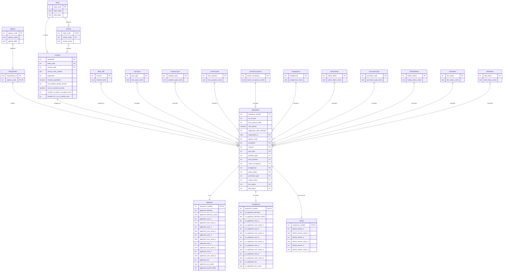

# Proposed entities and relationships (for Task 2)

This is a proposal. Task 2 draws the final diagram in draw.io using the crow's foot (Oracle) notation from class.

The ground rules come from the assignment:

- Every one of the 78 CSV columns appears in at least one entity, under its original name.
- The only new attribute is `locationID`.
- Each entity is a real-world thing.
- Normalization comes in the next part of the project, so code/label pairs for applicant demographics stay together for now.

The home entity for each column is listed in [attribute_checklist.md](attribute_checklist.md). A column shown as FK in another entity is the same attribute acting as a reference; it is not a new attribute.

## Entities (20)

**Core entities**

| Entity | Real-world meaning | Key | Attributes it owns |
|---|---|---|---|
| **Application** | One loan application or purchased loan (one CSV row) | `sequence_number` | `as_of_year`, `loan_amount_000s`, `rate_spread`, `application_date_indicator` + FKs below |
| **Applicant** | The primary borrower on an application | `sequence_number` (PK + FK) | `applicant_ethnicity(_name)`, `applicant_race_1..5`, `applicant_race_name_1..5`, `applicant_sex(_name)`, `applicant_income_000s` |
| **CoApplicant** | The second borrower, if any | `sequence_number` (PK + FK) | `co_applicant_ethnicity(_name)`, `co_applicant_race_1..5`, `co_applicant_race_name_1..5`, `co_applicant_sex(_name)` |
| **Denial** | The lender's decision to deny, with up to 3 reasons | `sequence_number` (PK + FK) | `denial_reason_1..3`, `denial_reason_name_1..3` |
| **Respondent** | The reporting lender | (`respondent_id`, `agency_code`) | `respondent_id` |
| **Agency** | The federal regulator of the lender | `agency_code` | `agency_name`, `agency_abbr` |

**Geography**

| Entity | Real-world meaning | Key | Attributes it owns |
|---|---|---|---|
| **Location** | A census tract (plus its census statistics) where the property is | `locationID` (new) | `census_tract_number`, `population`, `minority_population`, `hud_median_family_income`, `tract_to_msamd_income`, `number_of_owner_occupied_units`, `number_of_1_to_4_family_units` |
| **County** | A county | (`state_code`, `county_code`) | `county_code`, `county_name` |
| **State** | A state | `state_code` | `state_name`, `state_abbr` |
| **MSA_MD** | A metropolitan statistical area / division | `msamd` | `msamd_name` |

**Code lookups.** Each one is a code plus its plain-language label.

| Entity | Key | Label |
|---|---|---|
| LoanType | `loan_type` | `loan_type_name` |
| PropertyType | `property_type` | `property_type_name` |
| LoanPurpose | `loan_purpose` | `loan_purpose_name` |
| OwnerOccupancy | `owner_occupancy` | `owner_occupancy_name` |
| Preapproval | `preapproval` | `preapproval_name` |
| ActionTaken | `action_taken` | `action_taken_name` |
| PurchaserType | `purchaser_type` | `purchaser_type_name` |
| HOEPAStatus | `hoepa_status` | `hoepa_status_name` |
| LienStatus | `lien_status` | `lien_status_name` |
| EditStatus | `edit_status` | `edit_status_name` |

That comes to 20 entities. The assignment suggests roughly 10 to 15. If Task 2 wants fewer boxes, `EditStatus` is the easiest one to fold into Application, because it is blank in every row. I'd keep the rest, since each is a distinct real-world classification.

**Foreign keys in Application:**

- `respondent_id` + `agency_code` → Respondent
- `locationID` → Location
- `msamd` → MSA_MD
- `loan_type`, `property_type`, `loan_purpose`, `owner_occupancy`, `preapproval`, `action_taken`, `purchaser_type`, `hoepa_status`, `lien_status`, `edit_status` → their lookups

## Relationships and cardinality

| Relationship | Parent side | Child side | Reasoning |
|---|---|---|---|
| Agency regulates Respondent | exactly one | one or many | Every lender has one regulator for a given report; each agency here has lenders |
| Respondent reports Application | exactly one | one or many | Every row has a lender; every lender in the file filed at least one row |
| Application has Applicant | exactly one | exactly one | Every row has applicant fields |
| Application has CoApplicant | exactly one | zero or one | 182,418 rows say "No co-applicant" |
| Application receives Denial | exactly one | zero or one | Reasons only appear for denied applications (action_taken 3 or 7) |
| Location contains Application | exactly one | one or many | See the Location notes below |
| MSA_MD contains Application | zero or one | zero or many | 725 rows have no MSA/MD (rural or unknown) |
| State contains County | exactly one | one or many | |
| State contains Location | exactly one | one or many | |
| County contains Location | zero or one | one or many | Some locations have no county on record |
| Each lookup classifies Application | exactly one | zero or many | Every code column is filled in every row (except `edit_status`, which is always blank, so it is zero or one) |

## Evidence from the data (why the keys are what they are)

I checked these on all 349,563 rows. Re-run them with `python3 task1/check_dependencies.py`.

- **Respondent needs `respondent_id` and `agency_code` together.** There are 854 distinct `respondent_id` values but 856 (`respondent_id`, `agency_code`) pairs. Two lenders (0000025093 and 0000013879) report under both OCC and FDIC. This matches how HMDA identifies lenders.
- **`agency_code` determines `agency_name` and `agency_abbr`**, and every `*_code` determines its `*_name` label. Zero violations, which supports the lookup entities.
- **`county_code` determines `county_name`**, and `state_code` determines `state_name`/`state_abbr`.
- **(`county_code`, `census_tract_number`) determines all tract census statistics, including `hud_median_family_income`**, with zero violations. That's why the census statistics live on Location.
- **The tract does *not* determine `msamd`.** 127 tracts appear with two different MSA/MD codes (for example tract 7312.01 in county 29 is reported as both 35614 and 35620). The MSA/MD is therefore something each lender reports per application, so Application references MSA_MD directly and Location does not. `msamd` also doesn't determine `hud_median_family_income` (35620 maps to two incomes).
- **Why `locationID` is needed.** The natural key (`state_code`, `county_code`, `census_tract_number`) is blank in 676 rows (county and tract both missing) and partly blank in 21 more (county present, tract missing). A primary key can't contain NULLs, so `locationID` gives each of the 2,008 distinct combinations a surrogate key. The all-blank combination becomes an "unknown location in NJ" row, so every Application still has exactly one Location.
- **`census_tract_number` is not unique on its own.** 0513.00 exists in two counties, so a tract is identified only together with its county.

## Draft diagram (crow's foot)

GitHub renders this Mermaid block. Mermaid's `erDiagram` uses crow's foot marks: `||` means exactly one, `o|` zero or one, `|{` one or many, `o{` zero or many. To keep it readable, lookup entities are shown with their two attributes only.

## Things for Task 2 to decide or double-check

1. **Weak entities.** Applicant, CoApplicant and Denial have no key of their own. They borrow `sequence_number` from Application, so in Oracle-style notation they're identifying (weak) relationships. Draw them that way if that's how class covered it.
2. **Race 1–5 and denial reason 1–3 are repeating groups.** Leave them as-is for this diagram, because splitting them into separate race/reason entities would rename or remove original attributes. They're the obvious first targets when we normalize in the next part.
3. **Check the Oracle crow's foot cheat sheet from the slides.** The optional side uses the circle ("O") and the mandatory side uses the bar. Mermaid draws the same marks, but the draw.io version is the one we submit as a PDF.
